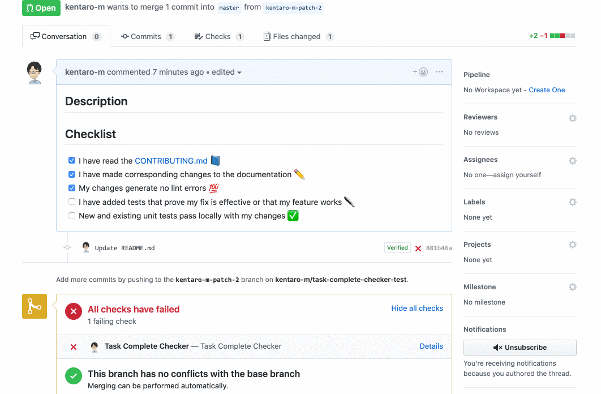

# Task Complete Checker

> A GitHub App built with [Probot](https://github.com/probot/probot) that checks if all tasks are completed in the pull requests.

## :arrow_forward: Usage


1. Install [the app](https://github.com/apps/task-complete-checker) with your repository
2. Create the pull request contained a checklist at a description field
3. Change to the success status if all the checklists are checked 

## :computer: Development

```sh
# Install dependencies
npm install

# Run the bot
npm start
```

## :rocket: Deploy

### Now
```bash
$ npm install -g now
$ now secrets add tcc-app-id "<APP_ID>"
$ now secrets add tcc-webhook-secret "<WEBHOOK_SECRET>"
$ now secrets add tcc-private-key "$(cat app.private-key.pem | base64)"
$ now
$ now alias https://task-complete-checker-hogefuga.now.sh <alias-name>
```

## :heart: Contributing

If you have suggestions for how task-complete-checker could be improved, or want to report a bug, open an issue! We'd love all and any contributions.

For more, check out the [Contributing Guide](CONTRIBUTING.md).

## :memo: License

[ISC](LICENSE) © 2019 Kentaro Matsushita <kentaro.m811@gmail.com> (https://github.com/kentaro-m/task-complete-checker)
